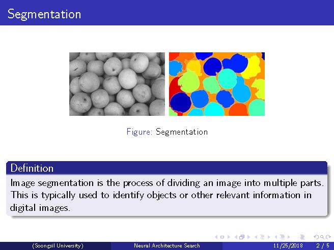
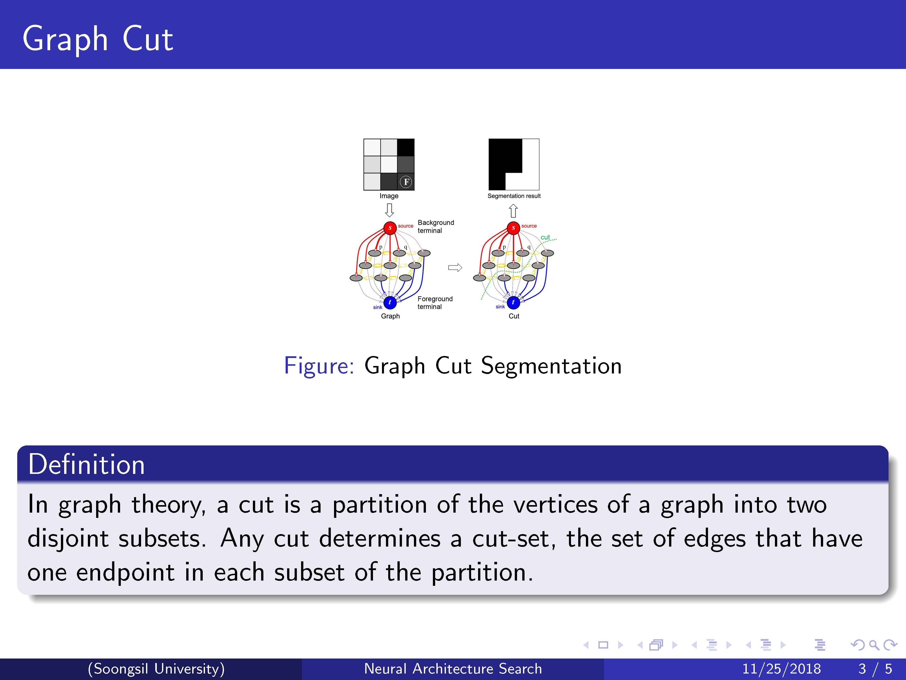
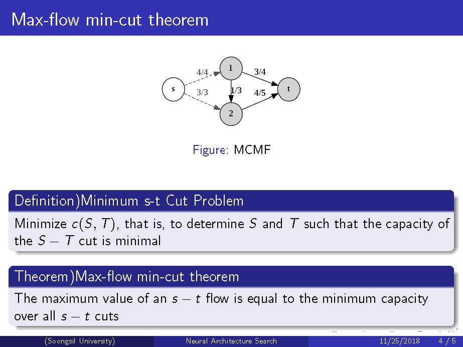
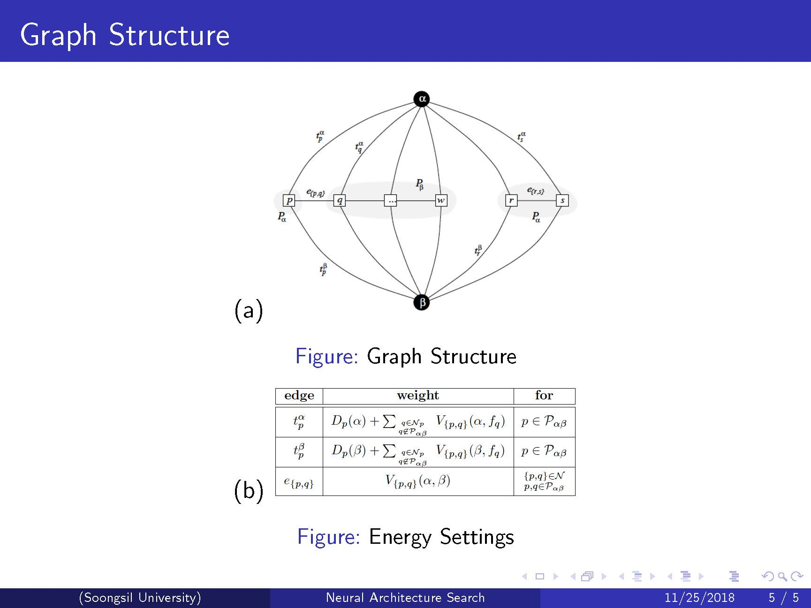
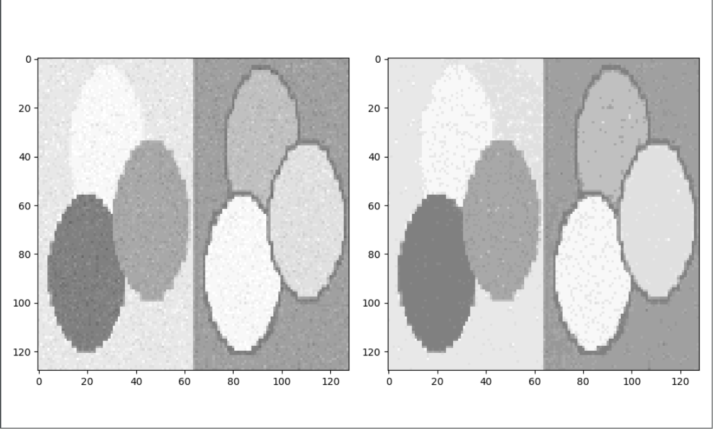
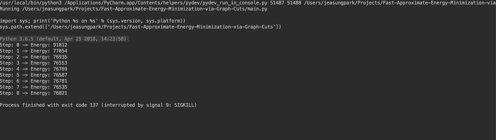

# Fast Approximate Energy Minimization via GraphCut

## Introduction

## Result

The image on the left is an image with gaussian noise added and the image on the right is an segmented image. You can now see that the algorithm has filtered out the noise and segmented correctly.

Below is the reported energy minimization process

